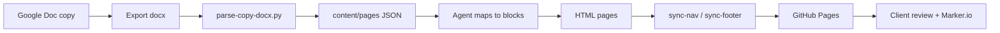

# Workflow: copy doc → wireframe → deploy

## Overview

## Phase 0 — Agent onboard (optional)

Load skill **`create-wireframe`** — intake questions, then Phases 1–4 in order.

## Phase 1 — Setup (once per client)

1. Create repo from static HTML wireframe base + this kit.
2. Fill `.wireframe-kit/config/client.yaml` (copy doc URL, `github_org` / `github_repo` / `preview_base_url`).
3. **GitHub:** `make setup-github SLUG=212-visual` — creates `katiebushdesign/{clientname}-wireframes` and enables Pages ([github-setup.md](./github-setup.md)).
4. Build `.wireframe-kit/config/site-map.yaml`: map **copy doc table titles** → paths at repo root (`solutions/high-impact.html`).
5. Extract recurring sections into `.wireframe-kit/blocks/*.html` with `{{placeholders}}`.
6. Document any client-only blocks in `block-mapping.md`.

## Phase 2 — Copy doc (writers + strategists)

- One Google Doc; **one table per page** (see [copy-doc-format.md](./copy-doc-format.md)).
- Separate **mega menu tables** at top of doc (or linked doc).
- Writers use normal Docs: bullets, bold, hyperlinks — no markdown, no `Title:` fields.

## Phase 3 — Ingest

1. Export doc as **`.docx`** (Drive API or Download).
2. Save to `.wireframe-kit/content/source/copy.docx` (gitignored if large).
3. Run from repo root: `make parse-copy`
4. Output: `.wireframe-kit/content/pages/<slug>.json` + `.wireframe-kit/content/nav/mega-menus.json`.

## Phase 4 — Build / update HTML (agent)

Load skill **create-wireframe** (full run) or **wireframe-from-copy-doc** (copy pass only).

For each page JSON:

1. Resolve slug from `site-map.yaml`.
2. For each section, map label + content shape → block (see [block-mapping.md](./block-mapping.md)).
3. Apply team-note rules ([notes-and-cues.md](./notes-and-cues.md)).
4. If page exists: **patch** copy in place; if greenfield: assemble from `blocks/`.
5. Run `make sync` if nav or IA changed.
6. Run `make serve` — local preview at `http://localhost:8765/` (onboard does this automatically).

## Phase 5 — Review & deploy

1. Push to branch; GitHub Pages preview URL to client.
2. Marker.io (or similar) on preview for pin feedback.
3. Copy changes loop: update Google Doc → re-export → parse → agent patch (structure changes are explicit: new row / new block).

## Greenfield vs revision

| Mode | Copy doc signals | Agent behavior |
|------|------------------|----------------|
| **Greenfield** | New table, empty repo page | Assemble full page from blocks + shell |
| **Revision** | Same table; changed body cells | Update text/CTAs/lists in existing HTML |
| **Structural** | New row, new section label, “new section” notes | Add block section; may need new `blocks/*.html` |

Team notes (any cell) apply in **both** modes — instructions, not published copy. Agents distinguish notes from copy per [notes-and-cues.md](./notes-and-cues.md).

## What we do not automate (yet)

- Figma ↔ HTML
- Full CMS
- Auto-deploy on every Google Doc edit (optional later: Drive webhook + CI)
